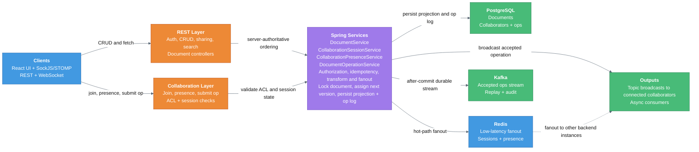
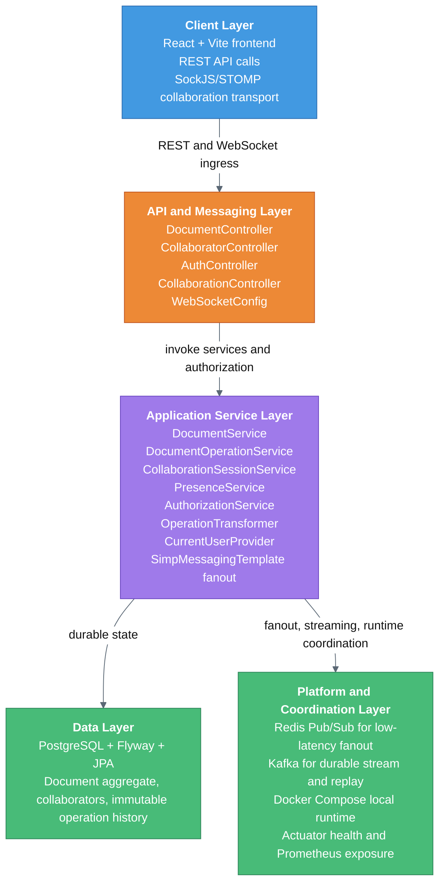

# Collaborative Document Engine

## Project Overview

A real-time collaborative document editing backend that solves the multi-user concurrent editing problem through server-authoritative operational transformation. Multiple clients can edit the same document simultaneously; the server serializes all operations, resolves conflicts, and fans out accepted operations to all connected instances.

This project is a portfolio and interview reference implementation demonstrating a horizontally scalable backend built with Spring Boot, PostgreSQL, Redis, Kafka, and STOMP/WebSocket collaboration.

## Business Context

### Purpose

Enable multiple users to read, edit, and share structured documents in real time while the server remains the ordering authority for accepted changes.

### Target Users

- Owners creating and managing documents
- Collaborators with role-based access
- Engineers and interviewers evaluating real-time collaboration architecture

### Core Value

- Durable document state and audit-friendly operation history
- Low-latency collaboration across backend instances
- Clear separation between hot-path fanout and durable event streaming
- An architecture that is practical to explain, defend, and evolve

## Architecture Overview

| Component | Role |
|---|---|
| PostgreSQL | Source of truth for documents, collaborators, operation history, and current document projection |
| Flyway | Schema lifecycle owner |
| JPA | Relational mapping and persistence validation |
| Redis Pub/Sub | Low-latency accepted-operation fanout and presence/session propagation between instances |
| Kafka | Durable accepted-operation stream for replay, audit, analytics, and async consumers |
| STOMP/WebSocket | Client collaboration transport |
| Spring Security | Authentication and request gating, with a pragmatic MVP identity flow and JWT-capable path |

### Architecture Summary

- PostgreSQL owns durable state.
- Redis owns speed-sensitive fanout and collaboration coordination.
- Kafka owns durable downstream event streaming.
- The backend is the ordering authority for accepted operations.
- Clients never decide the canonical server version.

## Data Flow Diagram



The collaboration hot path stays server-controlled: a client submits an operation with `operationId` and `baseVersion`, the backend validates access, transforms as needed, persists the accepted result, then publishes to Redis for low-latency fanout and Kafka for durability.

## Processing Pipeline

1. **Ingress**  
   REST calls handle document CRUD and sharing. STOMP endpoints handle join, leave, presence, and edit submission.

2. **Identity and ACL**  
   Spring Security authenticates HTTP and WebSocket traffic, then document-specific authorization checks gate read or write access.

3. **Validation**  
   Operation shape, session state, and collaborator semantics are validated before the write path proceeds.

4. **Ordering and Rebase**  
   The backend locks the document row, checks idempotency, loads intervening operations, and rebases or converts to `NO_OP` when needed.

5. **Persistence**  
   The materialized document snapshot and immutable operation record are saved in PostgreSQL under one transactional flow.

6. **Distribution**  
   Local subscribers receive immediate topic broadcasts, Redis propagates to other instances, and Kafka receives an after-commit accepted-operation event.

## System Architecture



### Layer Responsibilities

- **Client and editor**: React, Vite, Tiptap, SockJS, and STOMP combine metadata management with live editing.
- **Backend responsibility**: Spring Boot owns request handling, authorization, operation ordering, document projection updates, and downstream publication.
- **State boundaries**: PostgreSQL is the source of truth, Redis carries transient coordination and fanout, and Kafka holds durable accepted-operation events.
- **Scalability posture**: Any backend instance can accept a client connection, while Redis and Kafka let collaboration and event processing extend beyond one node.

## Features

### Functional

- Document CRUD and paginated listing for accessible resources
- Ownership transfer and collaborator permission management
- Real-time join, leave, presence, and accepted-operation messaging
- Operation log plus materialized current document state
- Search and filtering support for document discovery

### Non-Functional

- Idempotency checks on `operationId` avoid duplicate accepted operations
- Pessimistic locking serializes version assignment on the document aggregate
- Kafka publication occurs after commit to avoid durable events for rolled-back writes
- Redis propagation filters same-instance echoes to prevent duplicate broadcasts
- Flyway-controlled schema evolution with `ddl-auto=validate`
- Actuator health and Prometheus endpoints for runtime visibility
- Automated test coverage across controllers, services, Redis, Kafka, and end-to-end collaboration paths

## Multi-Instance Collaboration Flow

1. Client connects to any backend instance and joins a document channel.
2. Client submits an operation with `operationId`, `baseVersion`, and typed payload.
3. The instance validates ACL and operation shape.
4. The backend acquires a pessimistic lock on the document row.
5. It checks idempotency and transforms against intervening operations if needed.
6. The accepted operation and updated document projection are persisted transactionally.
7. The accepted operation is published to Redis and fanned out to clients connected to other backend instances.
8. The accepted operation is published to Kafka for replay, audit, analytics, and async consumers.

## Performance & Scalability

This system was benchmarked using :contentReference[oaicite:0]{index=0} to evaluate both baseline workloads and high-contention real-time collaboration scenarios.

### Key Results

| Metric            | Baseline (Independent Docs) | Contention (Same Doc) |
|------------------|----------------------------|------------------------|
| p95 Latency      | 11 ms                      | 3.05 s                 |
| Median Latency   | ~6 ms                      | 484 ms                 |
| Throughput       | 261 ops/sec                | 44 ops/sec             |
| Error Rate       | 0%                         | 0%                     |

| Aspect                                  | Observed Limit                     |
|-----------------------------------------|------------------------------------|
| Max throughput (independent docs)       | ~44 ops/sec                        |
| Comfortable concurrency (p50 < 500ms)   | ~30–40 users                       |
| Latency > 1s (p50)                      | ~50–60 users                       |
| Hard failure point                      | Not reached (0% errors at 100 VUs) |

### Summary

- The system achieves **high throughput and low latency** under non-contended workloads.
- Under heavy collaboration (100 users editing the same document), performance degrades due to **intentional serialization for consistency**.
- The system demonstrates **graceful degradation** — no errors, only increased latency.

👉 See full benchmark analysis: **[Performance & Scalability Report](./PERFORMANCE.md)**

## API Surface

### REST Endpoints

| Method | Path | Description |
|---|---|---|
| `POST` | `/api/documents` | Create a new document |
| `GET` | `/api/documents` | List documents accessible to the authenticated user |
| `GET` | `/api/documents/{id}` | Get a document by ID |
| `PUT` | `/api/documents/{id}` | Update document metadata |
| `DELETE` | `/api/documents/{id}` | Delete a document |
| `GET` | `/api/documents/{documentId}/collaborators` | List collaborators |
| `POST` | `/api/documents/{documentId}/collaborators` | Add a collaborator |
| `PUT` | `/api/documents/{documentId}/collaborators/{userId}` | Update collaborator role |
| `DELETE` | `/api/documents/{documentId}/collaborators/{userId}` | Remove a collaborator |
| `PUT` | `/api/documents/{documentId}/collaborators/owner` | Transfer document ownership |

All requests require an `X-User-Id` header containing a valid user UUID in the current MVP flow.

### STOMP Destinations

**Send (client to server)**

| Destination | Description |
|---|---|
| `/app/documents/{documentId}/sessions.join` | Join a document collaboration session |
| `/app/documents/{documentId}/sessions.leave` | Leave a document collaboration session |
| `/app/documents/{documentId}/presence.update` | Broadcast cursor or presence update |
| `/app/documents/{documentId}/operations.submit` | Submit an edit operation |

**Subscribe (server to client)**

| Topic | Description |
|---|---|
| `/topic/documents/{documentId}/sessions` | Session snapshot on join or leave |
| `/topic/documents/{documentId}/presence` | Presence events and cursor updates |
| `/topic/documents/{documentId}/operations` | Accepted operation broadcasts |

## Deployment

### Local Development

1. **Prerequisites:** Java 17 and Docker
2. Start infrastructure:
   ```bash
   docker compose up -d
   ```
3. Start the application:
   ```bash
   cd backend
   ./mvnw spring-boot:run
   ```
4. Verify:
   ```bash
   curl http://localhost:8080/actuator/health
   ```

### Runtime Footprint

- `compose.yaml` runs `postgres`, `redis`, `kafka`, `backend`, and `frontend`
- The backend is packaged with a two-stage Dockerfile using Maven and Eclipse Temurin JRE 17
- Environment variables inject PostgreSQL, Redis, Kafka, and JWT settings
- Flyway runs at startup and validates the schema

### Scale-Out Direction

- Multiple backend instances can serve clients because fanout is not tied to one node
- Redis keeps collaboration fast
- Kafka keeps downstream processing durable
- The architecture is ready for stricter JWT-first authentication and more advanced async consumers

Current identity handling mixes an `X-User-Id` oriented development flow with JWT-capable security components. In the architecture story, this is best described as a pragmatic MVP authentication layer with a clearer JWT-first production path.

## Running Tests

```bash
cd backend
./mvnw test
```

Note: `RedisAcceptedOperationFanoutTest` is skipped without Docker via `@Testcontainers(disabledWithoutDocker = true)`.

## Design Decisions

- **Server-authoritative OT over CRDT**: deterministic server ordering keeps the conflict path simple and auditable; CRDT generality is not needed for the MVP operation set.
- **Pessimistic lock for version slot assignment**: `SELECT FOR UPDATE` on the document row serializes concurrent submits without optimistic retry loops.
- **Redis vs Kafka responsibility split**: Redis is for speed and hot-path fanout; Kafka is for durability and downstream consumers.
- **H2 in tests, PostgreSQL in production**: keeps the test suite fast and self-contained while Flyway validates schema shape.
- **Pragmatic MVP identity model**: `X-User-Id` remains convenient for local and portfolio use, with JWT already present as the clearer production direction.
