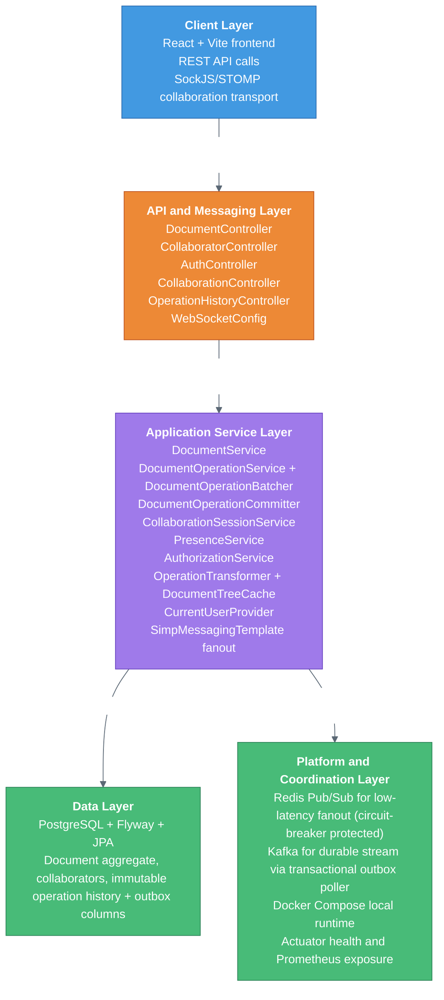

# Collaborative Document Engine

## Project Overview

A real-time collaborative document editing backend that solves the multi-user concurrent editing problem through server-authoritative operational transformation. Multiple clients can edit the same document simultaneously; the server serialises all operations, resolves conflicts, and fans out accepted operations to all connected instances.

This project is a portfolio and interview reference implementation demonstrating a horizontally scalable backend built with Spring Boot, PostgreSQL, Redis, Kafka, and STOMP/WebSocket collaboration.

## Business Context

### Purpose

Enable multiple users to read, edit, and share structured documents in real time while the server remains the ordering authority for accepted changes.

### Target Users

- Owners creating and managing documents
- Collaborators with role-based access
- Engineers and interviewers evaluating real-time collaboration architecture

### Core Value

- Durable document state and audit-friendly operation history
- Low-latency collaboration across backend instances
- Clear separation between hot-path fanout and durable event streaming
- An architecture that is practical to explain, defend, and evolve

## Architecture Overview

| Component | Role |
|---|---|
| PostgreSQL | Source of truth for documents, collaborators, operation history, and current document projection |
| Flyway | Schema lifecycle owner |
| JPA | Relational mapping and persistence validation |
| Redis Pub/Sub | Low-latency accepted-operation fanout and presence/session propagation between instances |
| Kafka | Durable accepted-operation stream via transactional outbox for replay, audit, analytics, and async consumers |
| STOMP/WebSocket | Client collaboration transport |
| Spring Security | Authentication and request gating, with a pragmatic MVP identity flow and JWT-capable path |

### Architecture Summary

- PostgreSQL owns durable state.
- Redis owns speed-sensitive fanout and collaboration coordination.
- Kafka owns durable downstream event streaming via a transactional outbox (zero silent drops).
- The backend is the ordering authority for accepted operations.
- Clients never decide the canonical server version.

## Data Flow Diagram


```mermaid
%%{init: {
  'theme': 'base',
  'themeVariables': {
    'primaryTextColor': '#ffffff',
    'lineColor': '#5b6875',
    'edgeLabelBackground': '#ffffff'
  },
  'themeCSS': '.edgeLabel rect { fill: #ffffff !important; opacity: 1 !important; } .edgeLabel span, .edgeLabel p, .edgeLabel foreignObject { color: #111111 !important; }'
}}%%
flowchart LR
    C["<b>Clients</b><br/>React UI + SockJS/STOMP<br/>REST + WebSocket"]
    R["<b>REST Layer</b><br/>Auth, CRUD, sharing, search<br/>Document controllers"]
    W["<b>Collaboration Layer</b><br/>Join, presence, submit op<br/>ACL + session checks"]
    S["<b>Spring Services</b><br/>DocumentService<br/>CollaborationSessionService<br/>CollaborationPresenceService<br/>DocumentOperationService + Batcher<br/>Authorization, idempotency, transform and fanout<br/>Enqueue op → batch drain → CAS commit projection + op log"]
    P["<b>PostgreSQL</b><br/>Documents<br/>Collaborators + ops + outbox"]
    Redis["<b>Redis</b><br/>Low-latency fanout<br/>Sessions + presence"]
    K["<b>Kafka</b><br/>Accepted ops stream<br/>Replay + audit"]
    O["<b>Outputs</b><br/>Topic broadcasts to connected collaborators<br/>Async consumers"]

    C -->|CRUD and fetch| R
    C -->|join, presence, submit op| W
    R -->|server-authoritative ordering| S
    W -->|validate ACL and session state| S
    S -->|persist projection and op log| P
    S -->|hot-path fanout| Redis
    P -->|outbox poller after commit| K
    S -->|broadcast accepted operation| O
    Redis -.->|fanout to other backend instances| O

    classDef data fill:#4299e1,stroke:#2b6cb0,color:#ffffff;
    classDef process fill:#ed8936,stroke:#c05621,color:#ffffff;
    classDef service fill:#9f7aea,stroke:#6b46c1,color:#ffffff;
    classDef durable fill:#48bb78,stroke:#2f855a,color:#ffffff;

    class C,Redis data;
    class R,W process;
    class S service;
    class P,K,O durable;
```

The collaboration hot path stays server-controlled: a client submits an operation with `operationId` and `baseVersion`, the server enqueues it into a per-document batcher, the batcher drains the queue in a single CAS write cycle, then publishes to Redis for low-latency fanout. Kafka publication happens via a transactional outbox poller after the commit, decoupling durability from the hot path.

## Processing Pipeline

1. **Ingress**
   REST calls handle document CRUD and sharing. STOMP endpoints handle join, leave, presence, and edit submission.

2. **Identity and ACL**
   Spring Security authenticates HTTP and WebSocket traffic, then document-specific authorisation checks gate read or write access.

3. **Validation**
   Operation shape, session state, stale-version cap, and collaborator semantics are validated before the write path proceeds. Operations more than `staleCap` (default 200) versions behind the current document version receive `RESYNC_REQUIRED`.

4. **Batching**
   The `DocumentOperationBatcher` accumulates ops for the same document in a `LinkedBlockingQueue` over a 5 ms window, then drains the batch in a single scheduler-thread cycle, eliminating concurrent CAS races.

5. **Ordering and Rebase**
   The batcher's drain cycle loads intervening operations, transforms the batch via the OT loop (pre-parsed into `ParsedAcceptedOp`; Caffeine-cached document tree), and accumulates accepted ops. Duplicate `operationId` submissions are silently re-broadcast.

6. **Persistence**
   The batcher calls `DocumentOperationCommitter.commitBatch()`: a single CAS version advance (`UPDATE documents SET current_version = ? WHERE current_version = ?`) plus `N` `INSERT document_operations` rows under `REQUIRES_NEW` transaction.

7. **Distribution**
   Local subscribers receive immediate topic broadcasts via STOMP. Redis pub/sub propagates accepted operations to other backend instances. The outbox poller reads committed rows and publishes to Kafka, with exponential-backoff retry and poison-row handling.

## System Architecture


```mermaid
%%{init: {
  'theme': 'base',
  'themeVariables': {
    'primaryTextColor': '#ffffff',
    'lineColor': '#5b6875',
    'edgeLabelBackground': '#ffffff'
  },
  'themeCSS': '.edgeLabel rect { fill: #ffffff !important; opacity: 1 !important; } .edgeLabel span, .edgeLabel p, .edgeLabel foreignObject { color: #111111 !important; }'
}}%%
flowchart TB
    Client["<b>Client Layer</b><br/>React + Vite frontend<br/>REST API calls<br/>SockJS/STOMP collaboration transport"]
    API["<b>API and Messaging Layer</b><br/>DocumentController<br/>CollaboratorController<br/>AuthController<br/>CollaborationController<br/>OperationHistoryController<br/>WebSocketConfig"]
    App["<b>Application Service Layer</b><br/>DocumentService<br/>DocumentOperationService + DocumentOperationBatcher<br/>DocumentOperationCommitter<br/>CollaborationSessionService<br/>PresenceService<br/>AuthorizationService<br/>OperationTransformer + DocumentTreeCache<br/>CurrentUserProvider<br/>SimpMessagingTemplate fanout"]
    Data["<b>Data Layer</b><br/>PostgreSQL + Flyway + JPA<br/>Document aggregate, collaborators, immutable operation history + outbox columns"]
    Platform["<b>Platform and Coordination Layer</b><br/>Redis Pub/Sub for low-latency fanout (circuit-breaker protected)<br/>Kafka for durable stream via transactional outbox poller<br/>Docker Compose local runtime<br/>Actuator health and Prometheus exposure"]

    Client -->|REST and WebSocket ingress| API
    API -->|invoke services and authorization| App
    App -->|durable state| Data
    App -->|fanout, streaming, runtime coordination| Platform

    classDef data fill:#4299e1,stroke:#2b6cb0,color:#ffffff;
    classDef process fill:#ed8936,stroke:#c05621,color:#ffffff;
    classDef service fill:#9f7aea,stroke:#6b46c1,color:#ffffff;
    classDef durable fill:#48bb78,stroke:#2f855a,color:#ffffff;

    class Client data;
    class API process;
    class App service;
    class Data,Platform durable;
```

### Layer Responsibilities

- **Client and editor**: React, Vite, Tiptap, SockJS, and STOMP combine metadata management with live editing. The client tracks `lastServerVersion`, detects version gaps, fetches missed operations via the resync endpoint, and handles `RESYNC_REQUIRED` errors from the server.
- **Backend responsibility**: Spring Boot owns request handling, authorisation, operation batching and ordering, document projection updates, and downstream publication.
- **State boundaries**: PostgreSQL is the source of truth, Redis carries transient coordination and fanout, and Kafka holds durable accepted-operation events via a transactional outbox.
- **Scalability posture**: Any backend instance can accept a client connection, while Redis and Kafka let collaboration and event processing extend beyond one node.

## Features

### Functional

- Document CRUD and paginated listing for accessible resources
- Ownership transfer and collaborator permission management
- Real-time join, leave, presence, and accepted-operation messaging
- Operation log plus materialised current document state
- Per-document operation resync endpoint with rate limiting (`GET /api/documents/{id}/operations?sinceVersion&limit`)
- Reconnect replay: missed operations delivered to reconnecting clients via session-scoped STOMP catchup queue
- Search and filtering support for document discovery

### Non-Functional

- **Optimistic locking**: CAS version advance (`UPDATE … WHERE current_version = expected`) replaces pessimistic lock; contention p95 dropped from 3.05 s → 14 ms
- **Operation batching**: per-document 5 ms accumulation window amortises CAS cost across concurrent submitters; zero retries under 100-VU load
- **OT pre-parsing + tree cache**: intervening operations pre-parsed once before the transform loop; document tree cached by `(documentId, serverVersion)` in Caffeine; eliminates repeated Jackson deserialisation per op
- **Stale-client cap**: ops more than 200 versions behind receive `RESYNC_REQUIRED` instead of silently failing; client fetches the gap and resubmits
- **Transactional Kafka outbox**: accepted operations written to the DB in the commit transaction, polled and published to Kafka by `OperationOutboxPoller`; zero silent drops on Kafka unavailability
- **Redis circuit breaker**: Resilience4j circuit breaker wraps Redis publish calls; Redis outage does not affect submission success or readiness probe
- **Consumer fault tolerance**: Kafka consumer uses `DefaultErrorHandler` with exponential backoff (1s → 4s → 16s) and DLT for unprocessable messages; Redis dedup by `operationId` prevents duplicate broadcasts on replay
- **Idempotency**: `operationId` uniqueness enforced at the DB level; duplicate submissions are re-broadcast without re-applying
- Flyway-controlled schema evolution with `ddl-auto=validate`
- Actuator health and Prometheus endpoints (`/actuator/prometheus`) for runtime visibility, including `operations.batch.size`, `operations.retries`, `operations.resync_required`, `outbox.pending`, `outbox.poison`, and `redis.circuit_open` gauges/counters

## Multi-Instance Collaboration Flow

1. Client connects to any backend instance and joins a document channel.
2. Client submits an operation with `operationId`, `baseVersion`, and typed payload.
3. The instance validates ACL, operation shape, and stale-version cap.
4. The `DocumentOperationBatcher` enqueues the op and schedules a drain after a 5 ms accumulation window.
5. The drain cycle loads intervening ops, runs the OT transform loop, and calls `DocumentOperationCommitter.commitBatch()`.
6. `commitBatch()` advances the document version with a CAS update and inserts all accepted ops in a `REQUIRES_NEW` transaction.
7. The accepted operations are published to Redis and fanned out to clients connected to other backend instances.
8. The outbox poller reads unpublished committed rows and publishes to Kafka for replay, audit, analytics, and async consumers.

## Performance & Scalability

Benchmarked using k6 at 100 VUs with the same ramp shape as the V1 baseline.

### V2 Key Results

| Metric          | Baseline (Own Doc) | Contention (Same Doc, accepted ops) |
|-----------------|--------------------|--------------------------------------|
| p95 Latency     | 205 ms             | **14 ms**                            |
| Median Latency  | 113 ms             | 12 ms                                |
| Throughput      | 187.89 ops/sec     | ~1 ops/sec accepted¹                 |
| Error Rate      | 0%                 | 92.60%²                              |

¹ Artificially low: the k6 script uses a static `baseVersion=0`, causing most ops to receive `RESYNC_REQUIRED`. In a real client workload accepted throughput would be significantly higher.

² `RESYNC_REQUIRED` responses are a k6 artefact, not service failures. 0 CAS retries were recorded across the full run.

### V1 → V2 Comparison

| Metric                       | V1              | V2                          | Change       |
|------------------------------|-----------------|-----------------------------|--------------|
| Contention p95 (accepted)    | 3.05 s          | 14 ms                       | **−99.5%**   |
| Contention median            | 484 ms          | 12 ms                       | **−97.5%**   |
| CAS / lock retries           | N/A             | 0                           | eliminated   |
| Independent p95              | 11 ms           | 205 ms                      | +18×¹        |
| Max throughput (single doc)  | ~44 ops/sec     | ~188 ops/sec                | **+4.3×**    |
| Comfortable concurrency      | ~30–40 users    | >100 users                  | **+2.5–3×**  |
| Latency > 1s (median)        | ~50–60 users    | Not observed at 100 VUs     | eliminated   |
| Hard failure rate            | 0%              | 0%                          | unchanged    |

¹ The independent-doc regression is caused by the P21 batcher's 5 ms window adding overhead even on uncontested documents. For shared-document workloads the window cost is amortised across multiple ops per drain.

👉 See full benchmark analysis: **[Performance & Scalability Report](./docs/perf/PERFORMANCE.md)**

## API Surface

### REST Endpoints

| Method | Path | Description |
|---|---|---|
| `POST` | `/api/documents` | Create a new document |
| `GET` | `/api/documents` | List documents accessible to the authenticated user |
| `GET` | `/api/documents/{id}` | Get a document by ID |
| `PUT` | `/api/documents/{id}` | Update document metadata |
| `DELETE` | `/api/documents/{id}` | Delete a document |
| `GET` | `/api/documents/{documentId}/collaborators` | List collaborators |
| `POST` | `/api/documents/{documentId}/collaborators` | Add a collaborator |
| `PUT` | `/api/documents/{documentId}/collaborators/{userId}` | Update collaborator role |
| `DELETE` | `/api/documents/{documentId}/collaborators/{userId}` | Remove a collaborator |
| `PUT` | `/api/documents/{documentId}/collaborators/owner` | Transfer document ownership |
| `GET` | `/api/documents/{documentId}/operations` | Paginated operation log since a version (`?sinceVersion=&limit=`) |

All requests require an `X-User-Id` header containing a valid user UUID in the current MVP flow.

### STOMP Destinations

**Send (client to server)**

| Destination | Description |
|---|---|
| `/app/documents/{documentId}/sessions.join` | Join a document collaboration session |
| `/app/documents/{documentId}/sessions.leave` | Leave a document collaboration session |
| `/app/documents/{documentId}/presence.update` | Broadcast cursor or presence update |
| `/app/documents/{documentId}/operations.submit` | Submit an edit operation |

**Subscribe (server to client)**

| Topic | Description |
|---|---|
| `/topic/documents/{documentId}/sessions` | Session snapshot on join or leave |
| `/topic/documents/{documentId}/presence` | Presence events and cursor updates |
| `/topic/documents/{documentId}/operations` | Accepted operation broadcasts |
| `/user/queue/catchup.{documentId}` | Missed operations replayed on reconnect |
| `/user/queue/errors.{documentId}` | `OPERATION_CONFLICT` and `RESYNC_REQUIRED` error responses |

## Kafka Operations

### Dead-Letter Topic (DLT)

The consumer uses `document-operations.DLT` for unprocessable messages (malformed JSON, exhausted retries after exponential backoff: 1s → 4s → 16s).

**Inspect DLT messages:**

```bash
kafka-console-consumer.sh \
  --bootstrap-server localhost:9092 \
  --topic document-operations.DLT \
  --from-beginning
```

**Replay DLT back to the main topic after fixing the root cause:**

```bash
kafka-console-consumer.sh \
  --bootstrap-server localhost:9092 \
  --topic document-operations.DLT \
  --from-beginning \
  --max-messages <N> | \
kafka-console-producer.sh \
  --bootstrap-server localhost:9092 \
  --topic document-operations
```

Replay is safe within the dedup TTL window: the consumer deduplicates by `operationId` via Redis (TTL 5 min). Operations delivered within the last 5 minutes will be suppressed on replay; older replayed operations will be re-broadcast to collaborators.

### Consumer Group Reset (full re-read from main topic)

```bash
kafka-consumer-groups.sh \
  --bootstrap-server localhost:9092 \
  --group notification-consumer-group \
  --reset-offsets \
  --topic document-operations \
  --to-earliest \
  --execute
```

## Fault Tolerance

### Redis Degradation

Redis is used for low-latency cross-instance fanout of accepted operations and presence events. It is **best-effort** — a Redis outage does not affect the hot path.

**When Redis is down:**
- `operations.submit` continues to succeed. The submitting client's editor receives the accepted operation via local STOMP fanout (same-instance).
- Cross-instance clients stop receiving real-time updates during the outage.
- The `redis.circuit_open` counter in `/actuator/prometheus` increments each time a publish is silenced because the circuit breaker is already open.
- The `redis.publish_failures` counter increments for each raw Redis publish failure (these failures drive the circuit breaker's failure-rate window toward tripping).
- The readiness probe (`/actuator/health/readiness`) stays `UP` — Redis health is advisory only.

**Client recovery:** Clients on other instances detect version gaps and call `GET /api/documents/{id}/operations?sinceVersion={v}` to catch up. No manual intervention or client reload required.

**Automatic recovery:** Lettuce reconnects automatically with `autoReconnect=true`. Once Redis is back, the `RedisMessageListenerContainer` rebinds subscriptions (within 5 s recovery interval) and normal cross-instance fanout resumes. No server restart needed.

**Operator signals:**
- `redis.publish_failures` counter rising indicates Redis is reachable but failing commands; `redis.circuit_open` spiking means the circuit breaker has tripped and all publishes are being dropped.
- `/actuator/health` shows Redis health as an advisory indicator (publicly accessible; `/actuator/health/readiness` excludes Redis so a Redis outage does not affect the readiness probe).

### Kafka Outage

The transactional outbox decouples Kafka availability from the hot path. Accepted operations are written to PostgreSQL in the same commit transaction as the document version advance. The `OperationOutboxPoller` reads unpublished rows and publishes to Kafka with exponential-backoff retry (`backoff-ms=500`, cap `2000 ms`, max `10` attempts). Rows that exhaust attempts are marked as poison and counted in `outbox.poison`.

- Submitting operations succeeds even while Kafka is paused.
- All ops published to Kafka after resume with no silent drops (verified by `OutboxChaosTest`).
- No duplicates in the happy path; at-least-once delivery; consumer deduplicates by `operationId`.

## Deployment

### Local Development

1. **Prerequisites:** Java 17 and Docker
2. Start infrastructure:
   ```bash
   docker compose up -d
   ```
3. Start the application:
   ```bash
   cd backend
   ./mvnw spring-boot:run
   ```
4. Start the frontend:
   ```bash
   cd frontend
   npm install && npm run dev
   ```
5. Verify:
   ```bash
   curl http://localhost:8080/actuator/health
   ```

### Runtime Footprint

- `compose.yaml` runs `postgres`, `redis`, `kafka`, `backend`, and `frontend`
- The backend is packaged with a two-stage Dockerfile using Maven and Eclipse Temurin JRE 17
- Environment variables inject PostgreSQL, Redis, Kafka, and JWT settings
- Flyway runs at startup and validates the schema

### Scale-Out Direction

- Multiple backend instances can serve clients because fanout is not tied to one node
- Redis keeps collaboration fast; the circuit breaker keeps Redis non-critical
- Kafka keeps downstream processing durable; the outbox ensures no silent drops
- The architecture is ready for stricter JWT-first authentication and more advanced async consumers

## Running Tests

```bash
cd backend
./mvnw test
```

Integration and chaos tests require Docker (Testcontainers). Tests that need Docker are annotated with `@Testcontainers(disabledWithoutDocker = true)` and skip automatically in environments without a Docker daemon.
